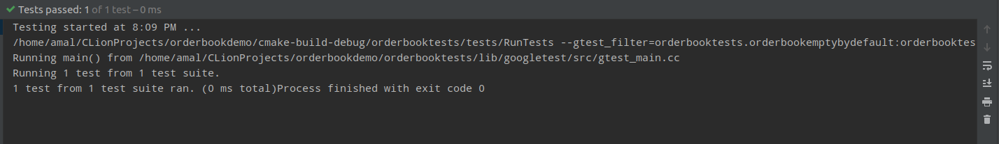

# Basic version of orderbook in C++

<h4>External Libraries: </h4>
<pre><a href="https://github.com/google/googletest">Google-test</a> [ add to the <b>/orderbooktests/lib/</b> ]  
<a href="https://www.boost.org/">Boost</a> </pre>

 

<h4> IDE: </h4>
<pre><a href="https://www.jetbrains.com/clion/">CLion</a></pre>

 

<h4> OS: </h4>
<pre>Description:	Ubuntu 19.04</pre>

 

<h4>Credits for the code: </h4>
<pre><a href="https://www.youtube.com/watch?v=fxN4xEZvrxI">Dimitri Nesteruk (YouTube Video)</a></pre>

 
<h4> Unit test: </h4>
<pre>

</pre>
